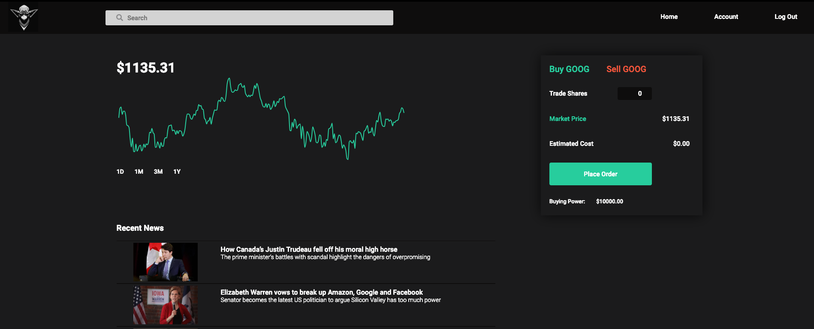

# Goblin

Goblin is a Robinhood clone, a stock and equities trading platform that offers free trades on transactions. The app allows you to view stocks in your portfolio and other stocks on the market in different date ranges and keep track of the shares you own. 

[Live Site](https://goblin-project.herokuapp.com/#/home)



Goblin uses the following <b>technologies</b> in its implemenation:
* Database: Postgresql
* Backend: Rails
* Frontend: React / Redux
* Styling: SCSS, CSS

### Key Features

Stock Charts:

Building out graphs was a very rewarding part of this app. Being able to display stock charts is an important feature in any stock trading tool. 

Getting the stock data required fetching API on the relevant stock data. IEX was a great resource that offered free API calls for a variety of stock related information and pricing. Next, a graphing tool was needed to be able to plot the information. I used Recharts, a graphing tool for React in which you can supply the data you want the graph to be composed of. The array of objects was sent from the api call to the chart, choosing each day's closing price, and thus the graph was formed. 

One challenge in building this app was in getting the graphs to re-display with different ranges when clicking date tags. I had to find a way to get the component to update, but the page would then run my API call on every state change. To solve this issue, a conditional statement was implemented in the componentDidUpdate lifecycle to only trigger when a specific part of the state was changed. 

``` js
...
componentDidUpdate(_prevProps, prevState) {
    if (prevState.interval !== this.state.interval) {
    fetchChart(this.state.ticker, this.state.interval)
        .then(res => this.setState({ data: res }))
        .then(res => this.setState({
            color: [
                (this.state.data[this.state.data.length - 1].close < this.state.data[0].close) ?
                    "#f1563a" : "#30cd9a"]
        }
        ));
    }
}

onChangeInterval(value) {
    this.setState({interval: value});
}
...
```

### Future Features:
* Implement Transactions and Watchlists
* Search for stocks via search bar 
* Supply stock info
* Account details, history, and settings